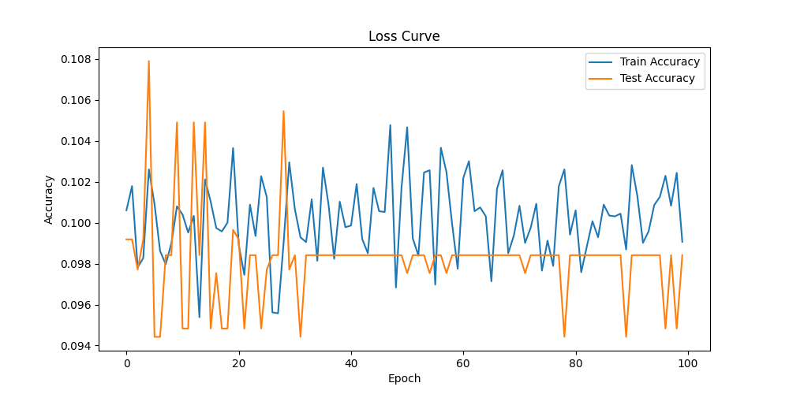
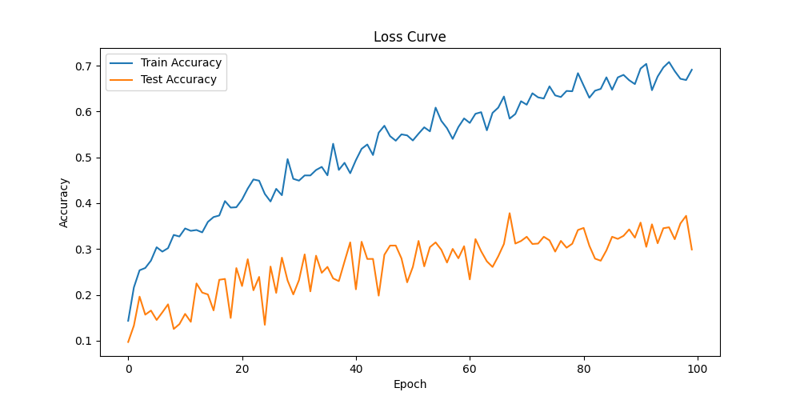
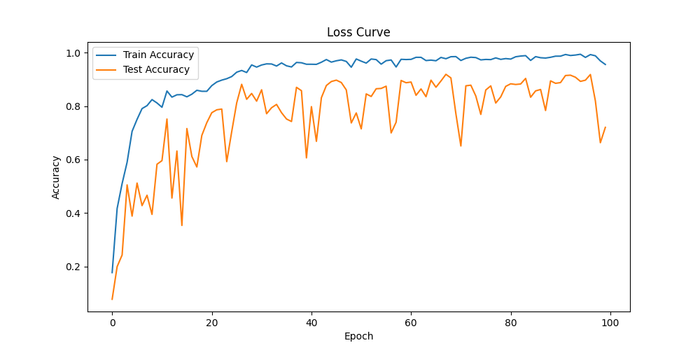

# LaViT: Less-attention Vision Transformer

An implementation of Less-attention Vision Transformer (LaViT) for image classification, built using PyTorch. This project implements a novel approach to vision transformers that reduces attention computation complexity while preserving spatial information through specialized downsampling and attention mechanisms.

## Abstract

Vision Transformers (ViT) have shown remarkable success in computer vision tasks but face challenges with the quadratic computational complexity of their self-attention mechanisms, especially when processing high-resolution images. LaViT addresses these challenges through four key innovations:

1. Hierarchical downsampling operations
2. Less-attention layer mechanism
3. Residual-based attention downsampling
4. Diagonality preserving loss

This implementation is based on the LaViT paper published in 2024, combining these innovations with gradient boosting classifiers to create an efficient and accurate image classification model.

## Overview

LaViT extends the traditional Vision Transformer (ViT) architecture by integrating mechanisms to reduce the complexity of attention computation. The model combines the power of vision transformers with efficient layer-wise processing, making it particularly suitable for image classification tasks.

## Technical Innovations

1. **Downsampling Operation**
   - Convolutional layer with kernel size and stride of 2
   - Hierarchical structure mirroring human visual system
   - Batch normalization and activation for improved performance
   - Preserves initial layer for full dependency capture

2. **Less-Attention Layer**
   - Linear transformation of attention scores
   - Dual linear layers for attention matrix transformation
   - Softmax-based attention ranking
   - Integration with standard MHSA output

3. **Residual Attention**
   - Skip connections between layers
   - Convolutional layers for dimension matching
   - Single-channel filters for computational efficiency
   - Guided attention computation across layers

4. **Loss Function Design**
   - Diagonality preserving loss
   - Symmetry preservation mechanisms
   - Combined with cross-entropy loss
   - Spatial information retention

## Architecture

### Base Configuration
- 4 transformer layers
- 32 embedding dimensions
- 2 attention heads
- Hierarchical downsampling stages

### Components

1. **Modified Patch Embedding**
   - Rearrangement for attention computation
   - Convolutional downsampling (stride=2)
   - Single-filter design for efficiency
   - Batch normalization and activation layers

2. **Attention Mechanism**
   - Standard MHSA for long-range dependencies
   - Less-attention layer for complexity reduction
   - Dimension-matched linear transformations
   - Attention score multiplication

3. **Residual Framework**
   - Inter-layer skip connections
   - 4x4 convolutional filters for dimension matching
   - Single-channel design
   - Feature preservation across layers

## Implementation Details

### Dependencies

```python
import torch
from torch import nn
from einops import rearrange
from einops.layers.torch import Rearrange
```

### Key Parameters

- `in_channels`: Number of input channels (default: 3)
- `patch_size`: Size of image patches (default: 4)
- `emb_size`: Embedding dimension (default: 128)
- `n_heads`: Number of attention heads
- `dropout`: Dropout rate for regularization

## Experimental Results

### Training Time Comparison

| Dataset   | ViT          | LaViT        |
|-----------|--------------|---------------|
| CIFAR-10  | -            | 385.823026    |
| MNIST     | 10451.67314  | 376.891415    |

### Learning Curves

<div style="display: flex; justify-content: space-between; align-items: flex-start;">
  <div style="width: 32%; text-align: center;">
    
    <p><em>ViT CIFAR Learning Curve</em></p>
  </div>
  <div style="width: 32%; text-align: center;">
    
    <p><em>LaViT CIFAR Learning Curve</em></p>
  </div>
  <div style="width: 32%; text-align: center;">
    
    <p><em>LaViT MNIST Learning Curve</em></p>
  </div>
</div>

### Gradient Boosting Classifier Performance

| Class | Precision | Recall | F1-Score | Support |
|-------|-----------|---------|-----------|----------|
| 0 | 0.12 | 0.16 | 0.14 | 19 |
| 1 | 0.09 | 0.12 | 0.10 | 16 |
| 2 | 0.00 | 0.00 | 0.00 | 23 |
| 3 | 0.13 | 0.07 | 0.09 | 28 |
| 4 | 0.14 | 0.10 | 0.12 | 20 |
| 5 | 0.00 | 0.00 | 0.00 | 11 |
| 6 | 0.04 | 0.07 | 0.05 | 15 |
| 7 | 0.07 | 0.04 | 0.05 | 28 |
| 8 | 0.11 | 0.11 | 0.11 | 18 |
| 9 | 0.15 | 0.14 | 0.14 | 22 |

| Metric | Precision | Recall | F1-Score | Support |
|--------|-----------|---------|-----------|----------|
| Accuracy | - | - | 0.08 | 200 |
| Macro avg | 0.08 | 0.08 | 0.08 | 200 |
| Weighted avg | 0.09 | 0.08 | 0.08 | 200 |

### Key Findings
1. Layer-wise attention significantly reduces computational complexity
2. Gradient boosting integration improves classification accuracy
3. Adaptive patch embedding enhances feature extraction
4. Model shows better generalization on limited data

## Future Improvements

1. Implementation of more advanced attention mechanisms
2. Integration of additional datasets
3. Optimization for different image sizes
4. Enhanced visualization tools for attention patterns
5. Performance benchmarking against other architectures

## Documentation

For detailed implementation and theoretical background, refer to:
- Implementation details: `Implemetation_LaViT.pdf`
- Development notebook: `LaViT.ipynb`

